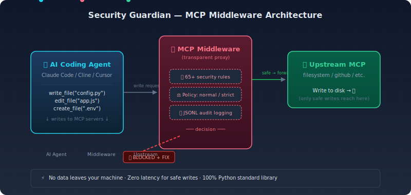

<div align="center">

# 🛡️ Security Guardian

**Your AI Coding Agent's Security Layer**  
Real-time secret & vulnerability scanning — stop leaks before they happen.

<div>

[](https://github.com/yangyz1988/security-guardian)
[](LICENSE)
[](#)
[](#)

</div>

### ✨ One command to secure your AI agent

```bash
bash middleware/setup.sh    # Auto-detect & configure Claude Code / Cline / Cursor
```

---

[How it works](#-how-it-works) • [Quick start](#-quick-start) • [Features](#-features) • [Integrations](#-integrations) • [Roadmap](#-roadmap)

</div>

---

## 🔥 The problem

You ask Claude Code to add an API key. It writes:

```python
api_key = "sk-proj..."   # ← leaked into your codebase
```

**With Security Guardian:**

```
AI writes  →  MCP Middleware intercepts  →  🚨 BLOCKED!
                                          →  💡 "Use environment variables instead"
```

No secret hits your disk. No commit. No push. No GitHub security alert.

> AI coding agents write ~30% more vulnerable code than humans ([Stanford study](https://ai.stanford.edu/...)).  
> Security Guardian is the **airbag** for your AI copilot.

---

## ⚡ Quick start

```bash
# 1. Clone & go
git clone https://github.com/yangyz1988/security-guardian.git
cd security-guardian

# 2. One-command setup (auto-detects your AI agent)
bash middleware/setup.sh

# 3. Done. Your AI agent is now protected.
```

That's it. Next time Claude writes a secret, Cline edits a config file, or Cursor touches a Dockerfile — Security Guardian scans, warns, and blocks.

### What gets intercepted

| Severity | What it catches | Example |
|----------|----------------|---------|
| 🔴 **Critical** | OpenAI keys, AWS keys, DB passwords, SSH keys, Stripe live keys | `sk-...`, `AKIA...`, `ghp_...` |
| 🟠 **High** | Hardcoded secrets, SQL injection, command injection, path traversal | `api_key=`, `cursor.execute(f...)` |
| 🟡 **Medium** | JWT tokens, SSRF risks, insecure crypto | `jwt.io`, `requests.get(user_input)` |
| 🔵 **Low** | TOCTOU, weak random | `os.path.exists` + `os.remove` |

---

## 🏗 How it works



Security Guardian sits **between** your AI agent and its MCP servers. Every write goes through the proxy:

1. **Intercept** → AI calls `write_file` / `edit_file` / `create_file`
2. **Scan** → Match against 65+ regex rules (secrets + OWASP + deps + config)
3. **Decide** → Block, warn, or allow based on policy mode
4. **Log** → All actions recorded to `~/.security-guardian/audit/YYYY-MM-DD.jsonl`

---

## 🔌 Integrations

| Agent | Setup | How it connects |
|-------|-------|-----------------|
| **Claude Code** | `bash middleware/setup.sh --claude` | MCP server config → proxy |
| **Cline** | `bash middleware/setup.sh --cline` | VS Code `cline.mcpServers` |
| **Cursor** | `bash middleware/setup.sh --cursor` | `.cursor/mcp.json` → proxy |
| **Any MCP client** | Manual config | Replace upstream address with proxy |

All config templates: `middleware/config-templates/`

---

## 📋 Features

### 🚦 Real-time protection
- Intercepts `write_file`, `edit_file`, `create_file`, `patch_file`, `append_file` — anything an AI agent writes
- Three policy modes: **normal** (block critical, warn high), **strict** (block all critical+high), **relaxed** (log only)
- Audits read operations too — if AI reads a file with secrets, it's logged

### 🔍 65+ detection rules

| Category | Rules | What it finds |
|----------|-------|--------------|
| 🔑 **Secrets** | 12 | OpenAI, GitHub, AWS, Stripe, Slack, GitLab tokens; SSH keys; DB strings; hardcoded passwords |
| 🐞 **OWASP** | 13 | SQL injection, XSS, command injection, path traversal, XXE, NoSQL injection, LDAP injection, open redirect |
| 📦 **Dependencies** | 35+ | Known CVEs in Django, Flask, Requests, Pillow, PyYAML, lodash, axios, express + npm audit |
| ⚙️ **Config risks** | 5+ | Docker root user, privileged containers, host networking, empty env vars |

### 📊 Audit logging
- JSONL format
- Auto-rotates (7-day retention)
- `--status` CLI to check today's stats
- Per-agent tagging (SG_AGENT_NAME)

### 💰 Built-in monetization
- **Free**: Core interception + audit logging
- **Pro** ($29/mo): SARIF/HTML reports, auto-fix, custom rules
- **Team** ($99/mo): Multi-project management, compliance trends, Slack/Feishu alerts

---

## 🧪 Also included: CLI scanner

Security Guardian also ships a standalone CLI scanner for post-hoc analysis:

```bash
# Scan an entire project
python scripts/scan.py --path . --output html

# Auto-fix common issues
python scripts/fix.py --path . --apply
```

The MCP Middleware and CLI scanner **share the same rule engine** — improve one, improve both.

---

## 🗺 Roadmap

- [x] **v0.1** — Core scan + fix engine (50+ rules)
- [x] **v0.2** — HTML reports, CI/CD output formats
- [x] **v0.3** — Feishu integration, npm scanning, 6 new OWASP rules
- [x] **v0.4** — Claude Code / Cline adapter, one-click install
- [x] **v0.5** — MCP Middleware (real-time interception), license system
- [x] **v0.6** — One-click agent setup, config templates
- [ ] **v0.7** — `pip install security-guardian` package
- [ ] **v1.0** — Pro license activation, compliance PDF reports

---

## 🔒 Privacy

- **100% local**. All scanning happens on your machine. No data leaves.
- **No telemetry**. No API calls. No phoning home.
- License key check is the only network call (optional, for Pro features).

---

<div align="center">

### Built for the age of AI coding

**Security Guardian** · [GitHub](https://github.com/yangyz1988/security-guardian) · [Docs](middleware/AGENT_INTEGRATION.md)

*One-person AI company product — MIT License*

</div>
